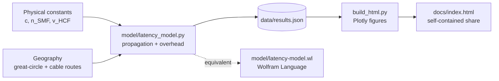

# latency-fibre-hcf-starlink

A reproducible, physics-grounded comparison of round-trip latency between London and two endpoints — New York and Sydney — over **standard single-mode fibre**, **hollow-core fibre**, and **Starlink** LEO satellite.

### → **[Live interactive page](https://adstuart.github.io/latency-fibre-hcf-starlink/)**

Drag the sliders (fibre refractive index, Starlink altitude, cable detour) and every number on the page updates live. Click *Fire packet* to watch a signal race across each medium.

## Architecture



## Headline numbers

| Route | SMF fibre | Hollow-core | Starlink (ideal) |
|---|---:|---:|---:|
| London ↔ New York | 62 ms | **42 ms** | 62 ms |
| London ↔ Sydney   | 216 ms | 148 ms | **156 ms** |

*Round-trip latency, propagation + modest router/processing overhead only. Full methodology, caveats, and references in the rendered HTML.*

The interesting finding: **hollow-core wins transatlantic; a fully ISL-meshed Starlink wins UK↔Sydney**, because submarine cables can't route anywhere near the great-circle between those two continents.

## Reproduce

```bash
python3 -m venv .venv && .venv/bin/pip install plotly jinja2 numpy
.venv/bin/python model/latency_model.py       # → data/results.json
.venv/bin/python build_html.py                # → docs/index.html
```

Or with the Wolfram version (free Wolfram Engine):

```bash
wolframscript -file model/latency-model.wl
```

## What the model does

- **Fibre**: `cable_km / v + n_hops · 50 µs`  with `v_SMF = c/1.468`, `v_HCF = 0.997 c`
- **Starlink ideal**: great-circle at orbital radius (R+550 km) + up/down hops + ~1 ms per ISL
- **Starlink realistic**: LEO access each side + terrestrial fibre backhaul across ISL-mesh gaps

Cable distances are representative 2025 production paths (TeleGeography). Starlink ISL mesh coverage snapshot is early-2026.

## What it does NOT capture

TCP handshake, TLS, congestion control, app-layer parsing, queuing jitter, BGP reroutes, or the fact that hollow-core isn't yet deployed on either route. See the rendered HTML for the full caveat list.

## References

1. ITU-T G.652 / Corning SMF-28 Ultra — group index ~1.467 at 1550 nm
2. Microsoft Azure blog, "Advancing networking with hollow-core fiber" (2023)
3. SpaceX Starlink Gen2 FCC filings; public ISL RTT measurements (2024)
4. TeleGeography Submarine Cable Map
